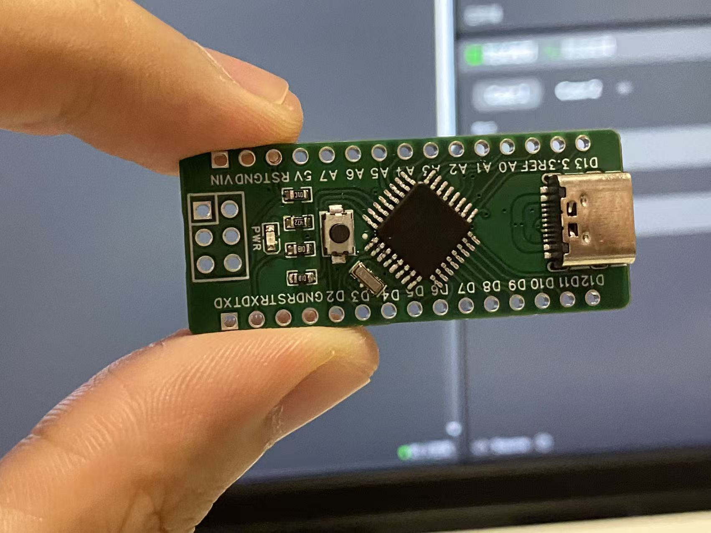
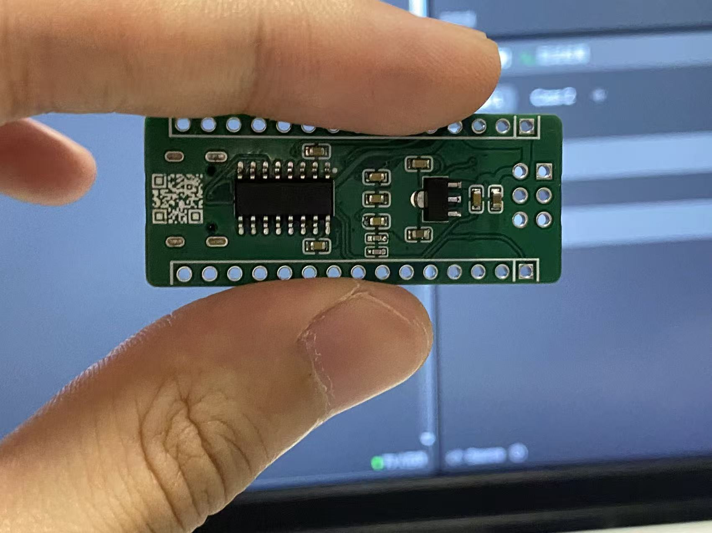
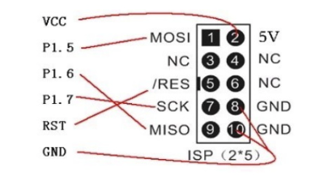
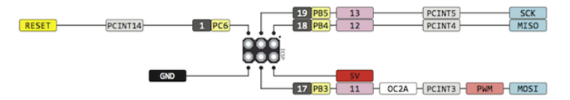
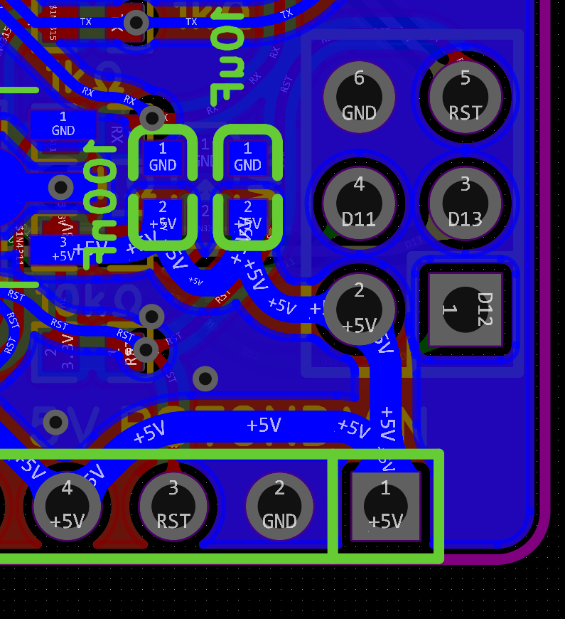
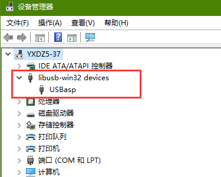
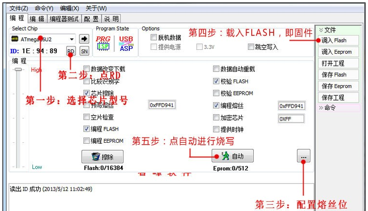
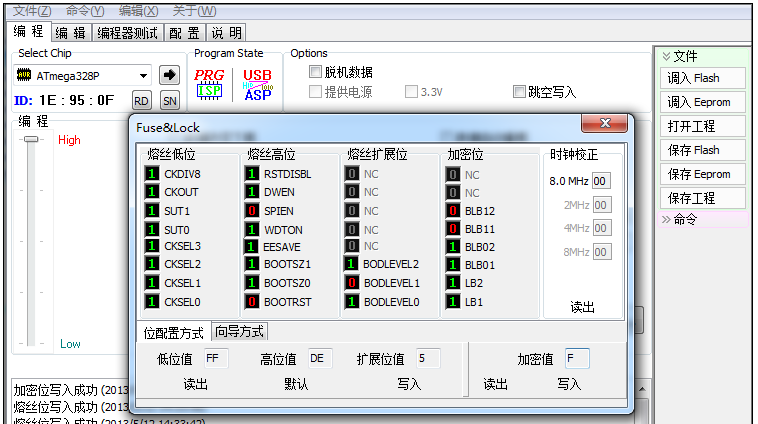
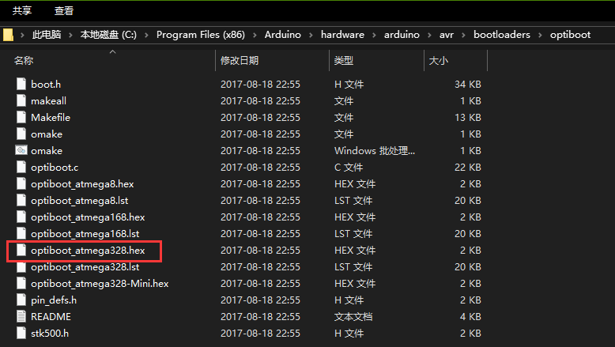

# Atmega328P Demo 程序说明

## 开发环境

VsCode 和以下插件:
- PlatformIO IDE
- C/C++

## 实验现象
核心板上所有 IO 口依次输出高低电平，每个状态保持约 3 秒。

---

## 核心板实物图

|  |
|:--:|
| 图 1 核心板正面 |

|  |
|:--:|
| 图 2 核心板反面 |

---

## 新芯片烧录 Bootloader 引导程序

### 1. USB-ASP 与 Atmega328P 连接

|  |
|:--:|
| 图 3 USB-ASP 引脚说明 |

需要找到以下引脚：  

- VCC  
- MOSI  
- GND  
- MISO  
- SCK  
- RESET  

并与 Atmega328P 芯片的 ICSP 引脚相连：  

|  |
|:--:|
| 图 4 Atmega328P 下载引脚图 |

|  |
|:--:|
| 图 5 Atmega328P 下载电路图 |

---

### 2. 安装 USBasp 驱动

|  |
|:--:|
| 图 6 USBasp 驱动显示效果 |

---

### 3. 下载 Arduino Bootloader

1. 将下载器连接到 Arduino UNO 开发板或 Atmega328P 最小系统的 **ICSP 引脚**  
2. 打开 **ProgISP 下载软件**  
3. 配置熔丝位（Fuse），点击 **写入** → 再点击 **读出**，确认与写入值一致  

|  |
|:--:|
| 图 7 ProgISP 设置界面 |

|  |
|:--:|
| 图 8 熔丝位写入与校验 |

Bootloader 固件位于 Arduino 安装目录：  

|  |
|:--:|
| 图 9 Bootloader 固件位置 |

---

## 程序下载与实验现象

引导程序烧录完成后，可在 VSCode 中打开本工程，编译并下载至核心板。  
运行后可观察实验现象：**所有 IO 口以 3 秒为周期翻转**。

---

## 参考资料
引导程序下载方法参考：  
[https://www.yourcee.com/newsinfo/2924454.html](https://www.yourcee.com/newsinfo/2924454.html)
